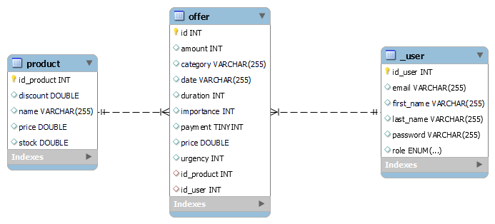

# BCI

Este proyecto tiene como objetivo lanzar ofertas a clientes aprovechando la fecha de Black Friday. 

## HERRAMIENTAS NECESARIAS
* Java 17
* SpringBoot: Para facilitar el desarrollo y creacion del proyecto.
* Maven: Para gestion de proyecto
* Spring Security: Como modulo de seguridad para crear y administrar usuario como asi tambien comprobar la identidad del mismo mediante la autenticación y manejo de token.
* Postman: Como cliente para realizar peticiones http
* Kibana: para observar logs.
* Kafka: Como plataforma de eventos para publicar a un topico las ofertas seleccionadas a cliente. Cualquier consumidor suscrito podra conocer estas ofertas.
* Swagger: Para documentar la API y utilizar los servicios RESTful.
* Docker: Se crea una imagen docker.
* MySQL workbench: Como herramienta para administrar la base de datos relacional.
* Amazon RDS: Como servicio de BD en la nube para facilitar la configuracion, disponibilidad y escalabilidad de los datos.
* Amazon EC2: Para crear servidores en la nube y garantizar disponibilidad, balanceo de cargas.  

## POSTMAN COLLECTION
https://github.com/juampidemarco/blackFriday/blob/master/src/main/resources/Black%20Friday.postman_collection.json

## DIAGRAMS
Diagrama de Tablas

## ENDPOINTS

1. singup: Este método registra el usuario con los datos enviados y retorna los datos del usuario creado.
* Endpoint: http://localhost:8081/api/v1/auth/signup
* Metodo: POST
* Body: {   
  "email": "juanpablo@gmail.com",
  "password": "12345678",
  "lastName": "de marco",
  "firstName": "juan pablo"
  }

2. signin: Si el usuario ya se encuentra registrado, debe acceder al servicio de login para hacer el proceso de autenticación y obtener el token JWT con el que se consumirán los métodos privados.
* Endpoint: http://localhost:8081/api/v1/auth/signin
* Metodo: POST
* Body: {   
  "email": "juanpablo@gmail.com",
  "password": "12345678"
  }

3. CreateProduct: Se utiliza para crear un producto y guardarlo en la base de datos.
* Endpoint: http://localhost:8081/api/v1/product/create
* Metodo: POST
* Body: {   
  "name": "pantalon",
  "price": 15999,
  "stock": 15,
  "discount": 1
  }

4. GetProduct: Se utiliza para obtener un producto por id.
* Endpoint: http://localhost:8081/api/v1/product/1
* Metodo: GET

5. CreateOffer: Se utiliza para generar una oferta para un usuario, asociandole un producto.
* Endpoint: http://localhost:8081/api/v1/offer/create
* Metodo: POST
* Body: {   
  "idProd": 1,
  "idClient": 1,
  "price": 10.8,
  "amount": 6,
  "importance": 3,
  "duration": 2,
  "urgency": 1,
  "category": 3,
  "paymentMethod": "CASH"
  }

6. ShowOffer: Se utiliza para obtener una oferta por id.
* Endpoint: http://localhost:8081/api/v1/offer/show/1
* Metodo: GET

7. Publish: Se utiliza para postear a un topico una oferta seleccionada a un cliente
* Endpoint: http://localhost:8081/api/v1/offer/publish
* Metodo: POST
* Body: {
  "idProd": 1,
  "idClient": 1,
  "price": 10.0,
  "amount": 6,
  "importance": 1,
  "duration": 1,
  "urgency": 1,
  "category": "1",
  "paymentMethod": "DEBIT"
  }

## SERVICIOS UTILIZADOS. CONFIGURACION Y FUNCIONAMIENTO

### 1. KAFKA
* Para configurar kafka seguir los siguientes pasos:
  * Descargar proyecto Kafka desde sitio oficial
  * Cambiar ruta de los archivos server y zookeeper en la carpeta config
  * Iniciar Zookeeper: .\bin\windows\zookeeper-server-start.bat .\config\zookeeper.properties
  * Iniciar Kafka: .\bin\windows\kafka-server-start.bat .\config\server.properties
  * Crear un nuevo topico: .\bin\windows\kafka-topics.bat --create --topic black-friday-topic --bootstrap-server localhost:9092
  * Describir los detalles del topico: .\bin\windows\kafka-topics.bat --describe --topic black-friday-topic --bootstrap-server localhost:9092
  * Listar todos los topicos: .\bin\windows\kafka-topics.bat --list --bootstrap-server localhost:9092
  * Iniciar consola para consumer: .\bin\windows\kafka-console-consumer.bat --topic  black-friday-topic --bootstrap-server localhost:9092

### 2. SERVICIO RDS
* Se utiliza el servicio de BD RDS de AWS para facilitar la configuracion, disponibilidad y escalabilidad de los datos.
  * Punto de enlace: testbci.cxke8mokiz26.us-east-1.rds.amazonaws.com
  * Puerto: 3306
  * User: admin
  * Pass: 12345678
  * Tablas generadas: _user, product, offer

### 3. DEPLOY EC2
* Empaquetar proyecto: .\mvnw clean install
* Crear instancia EC2 en AWS
* Configurar entorno linux de la instancia y subir el .jar generado
* Instalamos nginx como servidor proxy para redirigir el trafico http del puerto por defecto al que utilizara la app
* Desplegar la aplicacion
* Intalar herramientas necesarias para correr proyecto en la instancia
* Datos:
  * Direccion IPv4 Publica: 52.90.11.38
  * DNS de IPv4 Publico: ec2-52-90-11-38.compute-1.amazonaws.com

## EJECUCION LOCAL
1. Iniciar Zookeeper: .\bin\windows\zookeeper-server-start.bat .\config\zookeeper.properties
2. Iniciar Kafka: .\bin\windows\kafka-server-start.bat .\config\server.properties
3. Crear un usuario con el endpoint: http://localhost:8081/api/v1/auth/signup
4. Loguearse con el usuario generado con el endpoint: http://localhost:8081/api/v1/auth/signin y guardar el token que se generó.
5. Crear un producto con el endpoint: http://localhost:8081/api/v1/product/create
6. Crear una oferta asociando el usuario con el producto: http://localhost:8081/api/v1/offer/create
7. Notificar a un topico la oferta generada para ese usuario: http://localhost:8081/api/v1/offer/publish

## PLAN DE RECUPERACION DE DESASTRES (DR)

* Segun lo definido en el enunciado, RTPO Y RTO son de 2hs
* Para BD se utiliza Amazon RDS, donde:
  * Amazon RDS crea un respaldo o copia de seguridad (snapshot) del volumen asociado a su instancia de base de datos que respalda toda la instancia de base de datos y no solo bases de datos individuales. La primera copia de seguridad consiste en un snapshot de la instancia completa. Las copias de seguridad posteriores son de naturaleza incremental y los snapshots contienen solo los bloques que cambiaron desde la copia de seguridad (snapshot) anterior. Cada snapshot contiene punteros a todos los bloques de datos de los otros snapshots que se requieren para reconstruir la copia de seguridad. La eliminación del snapshot anterior no provoca la pérdida de datos, siempre y cuando exista al menos un snapshot que siga haciendo referencia a los datos originales.
  * La estrategia de recuperacion de desastres se puede observar mas detalladamente en la pagina ofical de AWS -> https://aws.amazon.com/es/blogs/aws-spanish/implementando-una-estrategia-de-recuperacion-de-desastres-con-amazon-rds/
* Para la APP se despliega en una instancia de Amazon EC2, donde:
  *  Permite configurar el servicio DRS de AWS para replicar servidores en direntes regiones.
  *  La estrategia de recuperacion de desastres se puede observar mas detalladamente en la pagina ofical de AWS -> https://aws.amazon.com/es/blogs/aws-spanish/creacion-de-una-estrategia-de-recuperacion-ante-desastres-con-aws-elastic-disaster-recovery/
